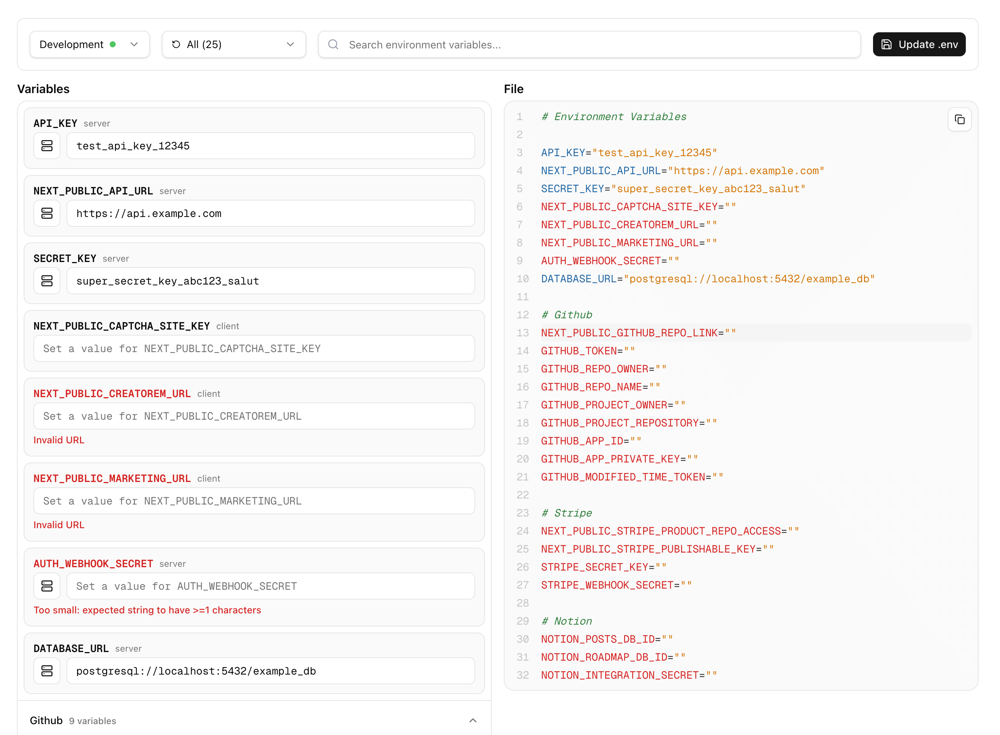

# t3-env-client



A web client to manage your environment variables when using the [t3-env](https://github.com/t3-oss/t3-env) library for type-safe environment variable validation. This package provides a beautiful, interactive interface to view, edit, and manage your environment variables directly from your browser.

## Features

- 🔍 **Type-Safe**: Works seamlessly with t3-env for full TypeScript support  
- 🔄 **Environment Switching**: Easily switch between development and production environments
- ✏️ **Live Editing**: Edit variables and write changes directly to your `.env` files
- 🔍 **Search & Filter**: Find variables quickly with search and status filtering
- 📝 **Live Preview**: See generated `.env` file content in real-time

## Installation

Install the package globally or as a dev dependency:

```bash
npm install -D t3-env-client
```

## Usage

### Quick Start

Run the client in your project directory:

```bash
npx t3-env-client
```

This will start the web interface at `http://localhost:3010`

### CLI Parameters

The CLI accepts several options to customize its behavior:

```bash
npx t3-env-client [options]
```

| Option | Short | Description | Default |
|--------|-------|-------------|---------|
| `--dir <path>` | `-d` | Directory path to your t3-env config | `./` |
| `--port <port>` | `-p` | Port to run the server on | `3010` |
| `--verbose` | `-v` | Enable verbose logging | `false` |

## Configuration

Create an `env-client.config.ts` file in your project root to configure the client:

```typescript
const envClientConfig = {
  envsPath: './envs.ts',
  writePermission: true,
  envFilePath: '.env.local',
};

export default envClientConfig;
```

### env-client.config.ts Options

| Property | Type | Required | Description | Default |
|----------|------|----------|-------------|---------|
| `envsPath` | `string` | ✅ | Path to your t3-env configuration file | - |
| `writePermission` | `boolean` | ❌ | Enable writing changes to env files | `false` |
| `envFilePath` | `string` | ❌ | Target file for writing env variables | `.env.local` |
